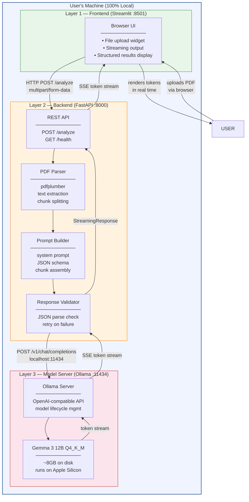
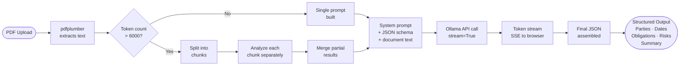
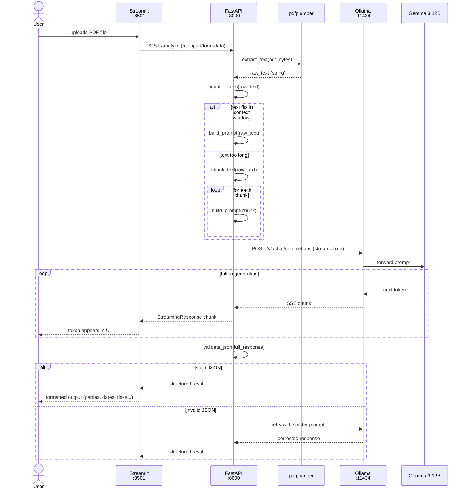
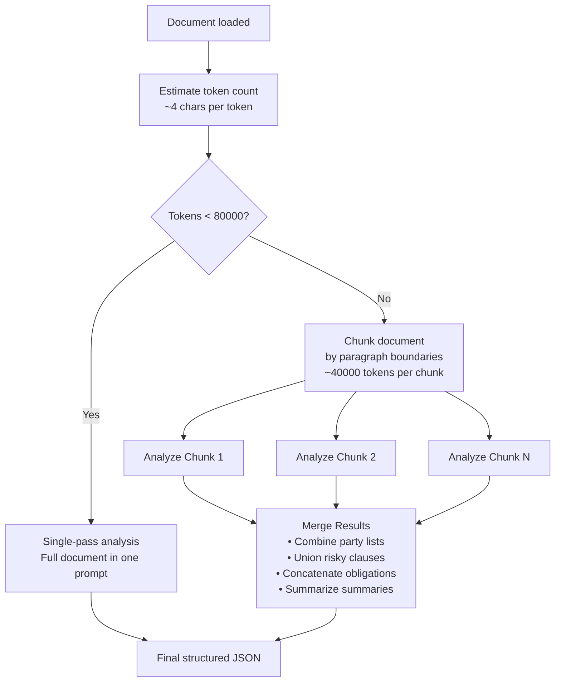

# PrivateDoc AI — Architecture Document

## 1. System Overview

PrivateDoc AI is a three-layer offline application. Every component runs on the user's
machine. No data crosses a network boundary. The local LLM is the only AI model involved.

### Core Design Constraint

> Sensitive legal documents must never leave the user's machine.

This single constraint drives every architectural decision in this document.

---

## 2. System Architecture



---

## 3. Data Flow

How a single PDF request travels through the system, from upload to structured output.



---

## 4. Sequence Diagram — Full Request Lifecycle

Shows the exact order of operations when a user uploads a document, including streaming.



---

## 5. Component Responsibilities

### 5.1 Streamlit (Frontend)

**Port:** 8501  
**Responsibility:** UI only. Accepts user input, calls the backend, displays output.

| Concern | How it's handled |
|---|---|
| File upload | `st.file_uploader` widget, PDF only |
| Streaming output | `st.write_stream` — renders tokens as they arrive |
| Result display | Parsed JSON rendered as tables and expanders |
| Backend call | `httpx` async client → `http://localhost:8000/analyze` |

Streamlit has no business logic. It does not call Ollama directly.

---

### 5.2 FastAPI (Backend)

**Port:** 8000  
**Responsibility:** Orchestration. Parses documents, builds prompts, calls the model, validates output.

| Endpoint | Method | Purpose |
|---|---|---|
| `/analyze` | POST | Main endpoint. Accepts PDF, returns SSE stream |
| `/health` | GET | Liveness check. Verifies Ollama is reachable |

Key internal modules:

| Module | Responsibility |
|---|---|
| `parser.py` | PDF → plain text via pdfplumber |
| `chunker.py` | Splits text when token count exceeds threshold |
| `prompt.py` | Assembles system prompt + document text |
| `ollama_client.py` | OpenAI-SDK wrapper pointed at localhost:11434 |
| `validator.py` | Parses and validates JSON response; triggers retry |

---

### 5.3 Ollama (Model Server)

**Port:** 11434  
**Responsibility:** Model lifecycle and inference. Acts as a local OpenAI-compatible API.

| Feature | Detail |
|---|---|
| API compatibility | OpenAI `/v1/chat/completions` endpoint |
| Model storage | `~/.ollama/models/` |
| Quantization | Handled automatically by model tag |
| Streaming | Native SSE support |
| Startup | `ollama serve` (runs as a background daemon) |

Ollama is infrastructure, not application code. The app treats it like a network service.

---

### 5.4 Gemma 3 12B Q4_K_M (Model)

**Size on disk:** ~8.1 GB  
**Context window:** 131,072 tokens  
**Quantization:** 4-bit (K-quant, medium)

| Property | Value |
|---|---|
| Full model name | `gemma3:12b` |
| Input | System prompt + user prompt (chat format) |
| Output | Free text — must be prompted to produce JSON |
| Best for | Instruction following, structured extraction |
| Weakness | Needs explicit JSON instructions; slower than 4B on CPU-only machines |

---

## 6. API Contract

### POST /analyze

**Request:**
```
Content-Type: multipart/form-data
Body: file (PDF binary)
```

**Response (streaming):**
```
Content-Type: text/event-stream
Body: stream of JSON tokens, terminated by a complete JSON object
```

**Final JSON shape:**
```json
{
  "parties": ["string"],
  "effective_date": "YYYY-MM-DD or null",
  "termination_date": "YYYY-MM-DD or null",
  "payment_terms": "string or null",
  "key_obligations": ["string"],
  "risky_clauses": ["string"],
  "governing_law": "string or null",
  "summary": "string",
  "follow_up_questions": ["string"]
}
```

### GET /health

**Response:**
```json
{
  "status": "ok",
  "ollama_reachable": true,
  "model": "gemma3:12b"
}
```

---

## 7. Context Window Strategy

Gemma 3 12B has a 131,072-token context window — large enough for most contracts.
In practice, Ollama caps the effective context at a lower limit to manage RAM. We set
a safe threshold of 80,000 tokens (well within the model's capability) and chunk anything
larger.



**Why 6,000 and not 8,192?** The system prompt and JSON schema consume ~800 tokens.
Leaving ~1,200 tokens of headroom prevents truncation errors.

---

## 8. Project Directory Structure

```
PrivateDocAI/
├── backend/
│   ├── main.py              # FastAPI app, route definitions
│   ├── parser.py            # PDF text extraction (pdfplumber)
│   ├── chunker.py           # Token counting and text splitting
│   ├── prompt.py            # System prompt and prompt assembly
│   ├── ollama_client.py     # Ollama API wrapper (OpenAI SDK)
│   └── validator.py         # JSON validation and retry logic
├── frontend/
│   └── app.py               # Streamlit UI
├── prompts/
│   └── legal_extraction.txt # System prompt template (versioned separately)
├── sample_docs/
│   └── sample_nda.pdf       # Test document (non-sensitive)
├── requirements.txt
├── .env.example
├── README.md
├── ARCHITECTURE.md          # This file
└── IMPLEMENTATION_PLAN.md   # Phase-by-phase build guide
```

---

## 9. Key Design Decisions

| Decision | What was chosen | What was rejected | Why |
|---|---|---|---|
| API compatibility layer | OpenAI Python SDK pointed at Ollama | Direct Ollama HTTP calls | Swap cloud/local by changing one env var |
| Streaming protocol | Server-Sent Events (SSE) | WebSockets, polling | SSE is simpler, one-directional, natively supported by FastAPI and browsers |
| JSON output strategy | Prompt engineering (instruct model to return JSON) | Function calling / tool use | Local models have inconsistent tool-use support; explicit prompting is more portable |
| Context overflow | Chunking + merge | RAG (vector store) | Simpler to implement and reason about for MVP; RAG is Phase 2 |
| Frontend framework | Streamlit | React + Vite | Eliminates JS build tooling; keeps stack 100% Python for MVP |
| Model | Gemma 3 12B | Llama 3.1 8B, Qwen 3 8B | Best instruction following on Apple Silicon at this size |

---

## 10. What This Architecture Does NOT Include (Yet)

These are deliberate omissions for the MVP. Each has a clear upgrade path.

| Missing Feature | Why Omitted | Future Approach |
|---|---|---|
| Vector store / RAG | Adds complexity; chunking is sufficient for MVP | ChromaDB + nomic-embed-text (local embeddings) |
| Authentication | Single-user local tool | FastAPI OAuth2 + session tokens if multi-user |
| Document history / database | No persistence needed for MVP | SQLite via SQLAlchemy |
| Multi-document comparison | Scope creep | Load two docs, diff structured JSON outputs |
| Desktop packaging | Complex for MVP | Tauri or Electron wrapping the same backend |
| GPU acceleration | Works without it on Apple Silicon | Ollama detects Metal GPU automatically; no code change needed |
