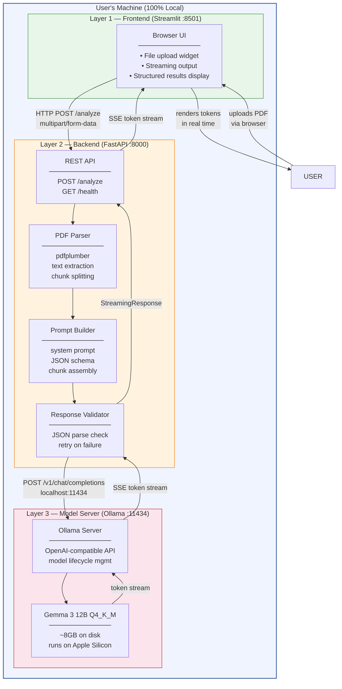
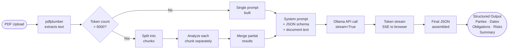
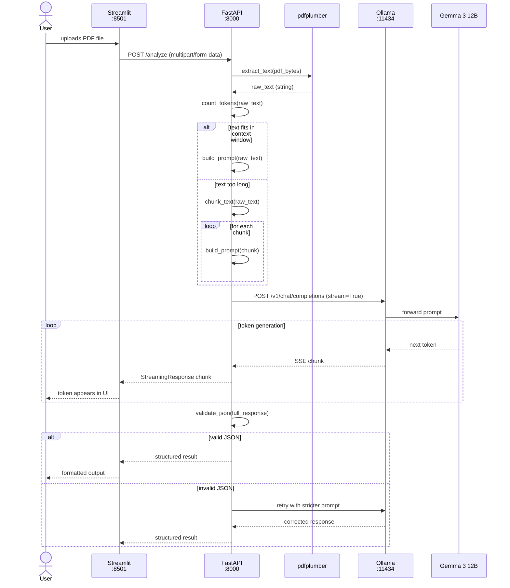
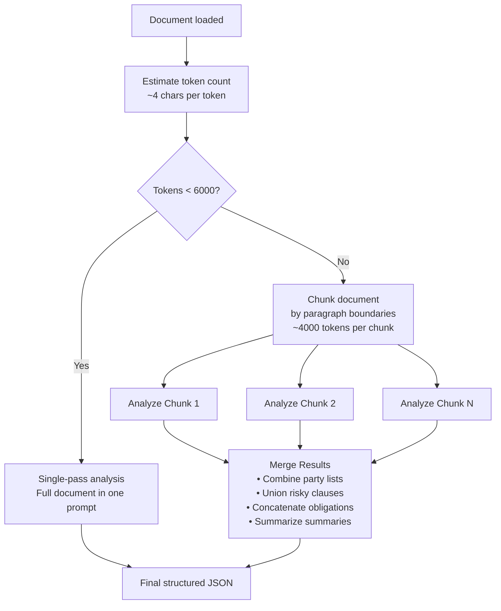
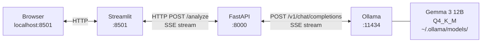

# PrivateDoc AI — Diagrams

Quick reference for all architecture diagrams. Full context and explanations are in [ARCHITECTURE.md](ARCHITECTURE.md).

---

## 1. System Architecture

---

## 2. Data Flow

---

## 3. Request Sequence (Upload → Streaming Output)

---

## 4. Context Window Decision Logic

---

## 5. Component Ports at a Glance

