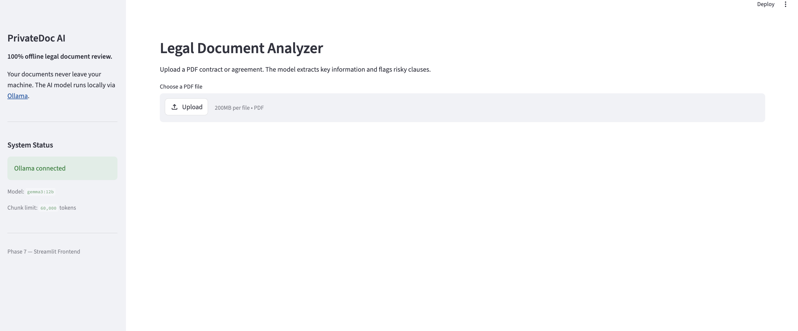
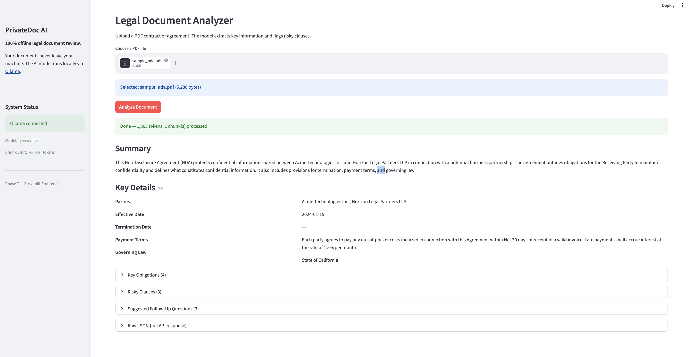
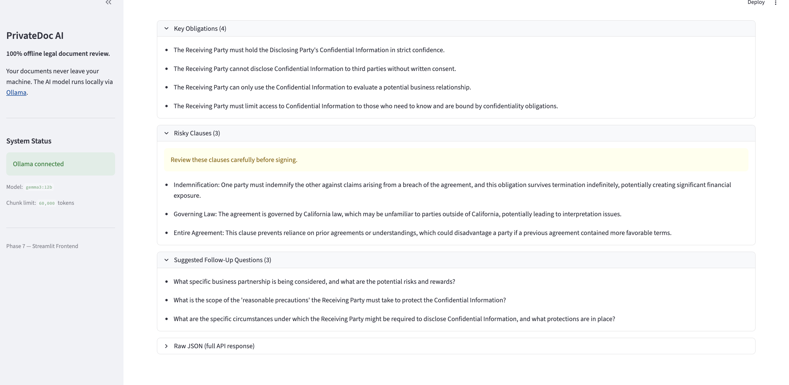
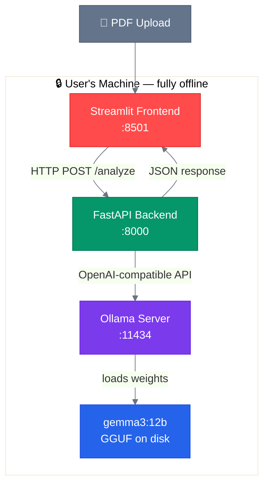

# PrivateDoc AI

**Offline legal document analysis — no API keys, no cloud, no data leaves your machine.**

PrivateDoc AI is a full-stack AI application that extracts structured information from legal PDF documents using a locally-running large language model. Upload a contract or agreement and get back parties, key dates, obligations, and flagged risky clauses in seconds — with zero network calls to external services.

---

## Screenshots

### 1. Upload interface — clean, minimal, status visible at a glance



### 2. Analysis results — summary and key details extracted from the document



### 3. Detailed extraction — obligations and risky clauses flagged with explanations



---

## Why Offline?

Legal documents contain sensitive information you should never send to a third-party API. PrivateDoc AI runs the entire AI pipeline locally:

```
Your PDF → pdfplumber → Ollama (local) → gemma3:12b → Structured JSON → Streamlit UI
```

No OpenAI key. No Anthropic key. No data transmission. The model runs on your own hardware.

---

## What It Extracts

Given a legal document, the model returns:

| Field | Example |
|---|---|
| **Parties** | Acme Technologies Inc., Horizon Legal Partners LLP |
| **Effective Date** | 2024-01-15 |
| **Termination Date** | 2025-01-15 |
| **Payment Terms** | Net 30 days |
| **Governing Law** | State of California |
| **Key Obligations** | Bullet list of all party obligations |
| **Risky Clauses** | Flagged clauses with explanation of risk |
| **Follow-up Questions** | Suggested questions to ask a lawyer |
| **Summary** | Plain-English paragraph summary |

---

## Tech Stack

| Layer | Technology | Why |
|---|---|---|
| Local model server | [Ollama](https://ollama.com) | Runs LLMs locally with an OpenAI-compatible API |
| LLM | Gemma 3 12B (q4_K_M) | 8.1 GB, 128k context, strong instruction following |
| Backend API | FastAPI + Python | Async, typed, auto-generates OpenAPI docs |
| PDF parsing | pdfplumber | Layout-aware text extraction |
| Frontend | Streamlit | Rapid data-app UI in pure Python |
| HTTP client | requests | Standard Python HTTP library |

---

## Architecture



**Key design decisions:**

- FastAPI uses the OpenAI Python SDK pointed at `http://localhost:11434/v1`. The same client code works with OpenAI's cloud API by changing the `base_url` — zero code changes needed.
- Documents larger than the model's effective context window are automatically split at paragraph boundaries and merged field-by-field.
- Temperature is fixed at `0.0` for deterministic, structured output.
- A retry mechanism catches malformed JSON and re-prompts the model to fix it.

---

## Project Structure

```
PrivateDocAI/
├── backend/
│   ├── main.py          # FastAPI app, all endpoints
│   ├── parser.py        # PDF text extraction and cleaning
│   ├── prompt.py        # System prompt loader
│   ├── chunker.py       # Token estimation, chunking, result merge
│   └── validator.py     # JSON extraction with fence stripping
├── frontend/
│   └── app.py           # Streamlit UI
├── prompts/
│   └── legal_extraction.txt  # System prompt with output schema
├── sample_docs/
│   ├── sample_nda.pdf          # 2-page NDA test document
│   ├── sample_employment.pdf   # 9-clause employment contract
│   ├── create_sample_nda.py    # Script to regenerate NDA PDF
│   └── create_sample_employment.py
├── requirements.txt
└── README.md
```

---

## Setup

Do this once after cloning the repo.

### Prerequisites

- Python 3.11+
- [Ollama](https://ollama.com/download) installed

### 1. Clone the repo

```bash
git clone https://github.com/ftavafi/PrivateDocAI.git
cd PrivateDocAI
```

### 2. Create a virtual environment and install dependencies

```bash
python -m venv .venv
source .venv/bin/activate      # Windows: .venv\Scripts\activate
pip install -r requirements.txt
```

### 3. Pull the model

```bash
ollama pull gemma3:12b
```

Downloads ~8.1 GB. Only needed once. Verify it worked:

```bash
ollama list
```

You should see `gemma3:12b` in the output.

---

## Running the App

Do this every time you want to use the app. You need **two terminals**.

### Terminal 1 — Start Ollama

```bash
ollama serve
```

> Skip this if Ollama is already running as a background service (check with `ollama list`).

### Terminal 2 — Start the FastAPI backend

```bash
source .venv/bin/activate      # Windows: .venv\Scripts\activate
uvicorn backend.main:app --reload
```

Backend available at `http://localhost:8000`.
Interactive API docs at `http://localhost:8000/docs`.

### Terminal 3 — Start the Streamlit frontend

```bash
source .venv/bin/activate      # Windows: .venv\Scripts\activate
streamlit run frontend/app.py
```

Opens automatically at `http://localhost:8501`.

Upload any PDF from `sample_docs/` or your own contract to try it out.

---

## Testing

This project does not include an automated test suite. Verification is done manually using the provided sample documents and the health check endpoint.

### 1. Verify the backend is healthy

```bash
curl http://localhost:8000/health
```

Expected response:

```json
{
  "status": "ok",
  "ollama_reachable": true,
  "model": "gemma3:12b",
  "chunk_token_limit": 60000
}
```

If `ollama_reachable` is `false`, Ollama is not running — start it with `ollama serve`.

### 2. Test with the sample NDA (single chunk)

Upload `sample_docs/sample_nda.pdf` via the UI or via curl:

```bash
curl -X POST http://localhost:8000/analyze \
  -F "file=@sample_docs/sample_nda.pdf" | python -m json.tool
```

Expected: `chunks: 1`, parties include `Acme Technologies Inc.` and `Horizon Legal Partners LLP`.

### 3. Test chunking with the sample employment contract

```bash
curl -X POST http://localhost:8000/analyze \
  -F "file=@sample_docs/sample_employment.pdf" | python -m json.tool
```

Expected: `chunks: 1` (2,851 tokens, well within the 60,000 limit), parties include `NovaTech Systems Inc.` and `Dr. Emily R. Hartwell`.

To force multi-chunk processing and test the merge logic, run with a reduced chunk limit:

```bash
CHUNK_TOKENS=700 uvicorn backend.main:app
```

Then re-upload the employment contract — it will split into 5 chunks and merge automatically.

---

## API Reference

The FastAPI backend exposes three endpoints:

| Endpoint | Method | Description |
|---|---|---|
| `/health` | GET | Ollama status, model name, chunk limit |
| `/analyze` | POST | Upload PDF → structured JSON |
| `/analyze/stream` | POST | Upload PDF → raw token stream |

Auto-generated interactive docs: `http://localhost:8000/docs`

---

## Configuration

All settings are controlled via environment variables:

| Variable | Default | Description |
|---|---|---|
| `OLLAMA_HOST` | `http://localhost:11434` | Ollama server address |
| `MODEL` | `gemma3:12b` | Any model available in Ollama |
| `CHUNK_TOKENS` | `60000` | Max tokens per chunk |

Example with a different model:

```bash
MODEL=llama3.2:3b uvicorn backend.main:app --reload
```

---

## Chunking and Long Documents

Documents longer than `CHUNK_TOKENS` are automatically split at paragraph boundaries and processed chunk-by-chunk. Results are merged field-by-field:

- **Scalar fields** (dates, governing law): first non-null value wins
- **List fields** (parties, obligations, clauses): union with deduplication
- **Summary**: chunk summaries joined in sequence

This handles arbitrarily long documents without truncation.

---

## Limitations

- PDF only (no DOCX, no scanned images — OCR not implemented)
- English language documents only
- Multi-chunk merges may produce generic party aliases ("Employee", "Company") alongside real names — a known limitation of chunk-level extraction
- Performance depends on hardware; expect 30–90 seconds per document on a CPU

---

## Portfolio Context

This is the first project in a series building toward a full-stack AI engineering portfolio. It demonstrates:

- Local LLM integration via the OpenAI-compatible API pattern
- Structured output extraction with prompt engineering and validation
- Context window management for long documents
- Full-stack Python AI application (FastAPI + Streamlit)
- Privacy-first architecture as a design constraint

Built with Python 3.13, FastAPI 0.136, Streamlit 1.57, Ollama, and Gemma 3 12B.
