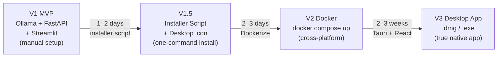

# PrivateDoc AI — V2 Desktop Packaging Plan

## The Problem

The base MVP requires the user to:

1. Install Ollama manually
2. Pull the model via terminal (`ollama pull gemma3:12b`)
3. Run the FastAPI backend (`uvicorn main:app`)
4. Run the Streamlit frontend (`streamlit run app.py`)
5. Open a browser tab

That is a 5-step developer workflow. A real product has a single double-click.

The challenge: unlike a typical desktop app, PrivateDoc AI has four moving parts
that must all be running simultaneously.

```
What a real app bundles:
┌─────────────────────────────────────────┐
│  One binary / installer                 │
│  ┌──────────┐  ┌──────────┐            │
│  │  UI      │  │ Backend  │            │
│  └──────────┘  └──────────┘            │
└─────────────────────────────────────────┘

What PrivateDoc AI must bundle:
┌─────────────────────────────────────────┐
│  ┌────────────┐  ┌────────────┐         │
│  │  Tauri UI  │  │  FastAPI   │         │
│  │  (Rust)    │  │  (Python)  │         │
│  └────────────┘  └────────────┘         │
│  ┌────────────┐  ┌────────────┐         │
│  │  Ollama    │  │ Gemma 3 12B │         │
│  │  (Go bin)  │  │  (~5 GB)   │         │
│  └────────────┘  └────────────┘         │
└─────────────────────────────────────────┘
```

---

## Three Upgrade Paths (Simplest → Most Polished)

### Path A — Installer Script

**Effort:** 1–2 days  
**Result:** Not a real desktop app, but a one-command install experience  
**Best for:** Portfolio demo, internal tool, technically comfortable users

A shell script that does everything:

```bash
# install.sh (macOS)
#!/bin/bash
echo "Installing PrivateDoc AI..."

# 1. Install Ollama if not present
if ! command -v ollama &> /dev/null; then
    curl -fsSL https://ollama.com/install.sh | sh
fi

# 2. Pull model if not present
ollama pull gemma3:12b

# 3. Install Python deps
pip install -r requirements.txt

# 4. Create a launcher script
cat > ~/Desktop/PrivateDocAI.command << 'EOF'
#!/bin/bash
ollama serve &
sleep 2
uvicorn backend.main:app --port 8000 &
sleep 1
streamlit run frontend/app.py
EOF
chmod +x ~/Desktop/PrivateDocAI.command

echo "Done. Double-click PrivateDocAI on your Desktop to launch."
```

**What the user does:** Download a zip, run `./install.sh`, double-click the desktop icon.

---

### Path B — Docker Compose

**Effort:** 2–3 days  
**Result:** Works on any OS with zero dependency management  
**Best for:** Enterprise deployments, teams, on-premises server installs

```yaml
# docker-compose.yml
version: "3.8"

services:
  ollama:
    image: ollama/ollama
    volumes:
      - ollama_data:/root/.ollama
    ports:
      - "11434:11434"
    deploy:
      resources:
        reservations:
          devices:
            - capabilities: [gpu]   # optional GPU passthrough

  backend:
    build: ./backend
    ports:
      - "8000:8000"
    environment:
      - OLLAMA_HOST=http://ollama:11434
    depends_on:
      - ollama

  frontend:
    build: ./frontend
    ports:
      - "8501:8501"
    environment:
      - BACKEND_URL=http://backend:8000
    depends_on:
      - backend

volumes:
  ollama_data:
```

**What the user does:** Install Docker Desktop → `docker compose up` → open browser.

**What makes this special:** The Ollama container and model live in a named Docker volume.
Model is only downloaded once, persists across restarts. No Python, no Ollama install on
the host machine. Works identically on Mac, Windows, and Linux.

**Architecture shift for this path:** Streamlit and FastAPI run in separate containers
and talk to each other via Docker's internal network, not localhost. One env var change.

---

### Path C — Tauri Desktop App (Real .dmg / .exe)

**Effort:** 2–3 weeks  
**Result:** A native desktop app. Double-click `.dmg` on Mac, `.exe` on Windows.  
**Best for:** A product you intend to sell or distribute publicly

This is the "real" v2. It is the most work but produces an application that is
indistinguishable from any other native desktop app.

#### How Tauri Works

Tauri is a Rust framework that:
- Creates a native window using the OS's built-in webview (WKWebView on Mac, WebView2 on Windows)
- Compiles to a small native binary (~5 MB)
- Can spawn and manage subprocesses (Ollama server, FastAPI backend)
- Can make filesystem calls, handle system tray, etc.

The frontend inside the Tauri window is any web UI — in v2 this means replacing
Streamlit with React (Streamlit cannot run inside a Tauri webview).

#### The Full V2 Stack

| Component | V1 (MVP) | V2 (Desktop) |
|---|---|---|
| UI framework | Streamlit | React + Vite (runs inside Tauri window) |
| UI shell | Browser tab | Native OS window (Tauri) |
| Backend | FastAPI (manually started) | FastAPI compiled to binary via PyInstaller, managed by Tauri |
| Model server | Ollama (manually installed) | Ollama binary bundled in app, managed by Tauri |
| Model weights | Manually pulled | Downloaded on first launch via in-app setup wizard |
| Distribution | Git clone | .dmg (Mac), .exe (Windows), .AppImage (Linux) |

#### What Tauri Manages

```
App Launch
    │
    ▼
Tauri binary starts
    │
    ├──► Spawns Ollama subprocess (bundled Ollama binary)
    │        └── waits for :11434 to be healthy
    │
    ├──► Spawns FastAPI subprocess (PyInstaller bundle)
    │        └── waits for :8000 to be healthy
    │
    └──► Opens native window
             └── loads React app at localhost:8000
```

Tauri's `sidecar` feature handles subprocess lifecycle — it starts them on app open
and kills them when the app closes.

#### First-Run Setup Wizard

The model (~5GB) cannot be bundled in the installer — that would make a 5GB download.
Instead, the app includes a setup wizard that runs once:

```
First Launch
    │
    ▼
┌─────────────────────────────────────┐
│  Welcome to PrivateDoc AI           │
│                                     │
│  One-time setup required.           │
│  We need to download the AI model.  │
│                                     │
│  Size: ~5 GB                        │
│  Location: ~/PrivateDocAI/models/   │
│                                     │
│  [████████░░░░░░░░░░] 42%           │
│  Downloading gemma3:12b...           │
│                                     │
│  Your documents never leave         │
│  this machine.                      │
└─────────────────────────────────────┘
```

After first-run, the model is cached. Subsequent launches open in ~3 seconds.

#### What the Package Looks Like

```
macOS:
PrivateDocAI-1.0.0.dmg
├── PrivateDocAI.app
│   └── Contents/
│       ├── MacOS/
│       │   └── PrivateDocAI          ← Tauri binary (entry point)
│       ├── Resources/
│       │   ├── sidecars/
│       │   │   ├── ollama-aarch64    ← bundled Ollama binary
│       │   │   └── backend-aarch64   ← PyInstaller FastAPI bundle
│       │   └── _up_                  ← React build (HTML/CSS/JS)
│       └── Info.plist

Windows:
PrivateDocAI-1.0.0-setup.exe         ← NSIS installer
After install:
C:\Program Files\PrivateDocAI\
├── PrivateDocAI.exe
├── sidecars\
│   ├── ollama.exe
│   └── backend.exe
└── resources\

Linux:
PrivateDocAI-1.0.0.AppImage          ← single portable binary
```

#### Download Size Comparison

| What's in the package | Size |
|---|---|
| Tauri binary | ~5 MB |
| React build | ~2 MB |
| Ollama binary | ~50 MB |
| PyInstaller FastAPI bundle | ~80 MB |
| **Total installer size** | **~140 MB** |
| Model (downloaded separately, first-run) | ~5 GB |

---

## Recommended Upgrade Path



**For your portfolio:** V1.5 (installer script) is the right stopping point. It makes
the project runnable by a non-developer and shows you understand the deployment problem.

**For a real product:** V2 Docker for enterprise/team deployments, V3 Tauri for
a consumer or SMB product.

---

## What Changes Between V1 and V2 (Code Impact)

Most of the app code does NOT change between versions. The core FastAPI backend,
prompt engineering, and PDF parsing are identical. What changes:

| Area | V1 | V2 |
|---|---|---|
| Frontend | Streamlit | React |
| Process management | Manual terminal | Tauri sidecar |
| Ollama install | User does it | App does it |
| Model pull | User does it | First-run wizard |
| Distribution | Git clone | Signed installer |
| Config | .env file | In-app settings UI |

The backend is a stable foundation. V2 is a shell upgrade, not a rebuild.

---

## Key Consideration: Model Storage Location

In all versions, the model must live somewhere on the user's machine that persists
between app launches. The standard locations:

| OS | Default Ollama model path |
|---|---|
| macOS | `~/.ollama/models/` |
| Windows | `C:\Users\<user>\.ollama\models\` |
| Linux | `~/.ollama/models/` |

In the Docker version, models live in a named Docker volume (persists across
container restarts, survives `docker compose down`).

In the Tauri version, you can override the path to keep models inside the app's
data directory (e.g., `~/Library/Application Support/PrivateDocAI/models/` on Mac),
so uninstalling the app also removes the model.
